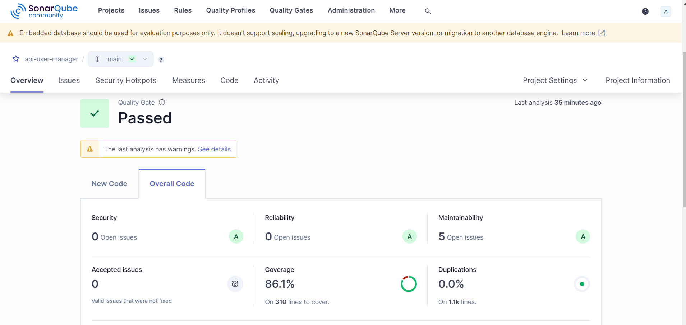
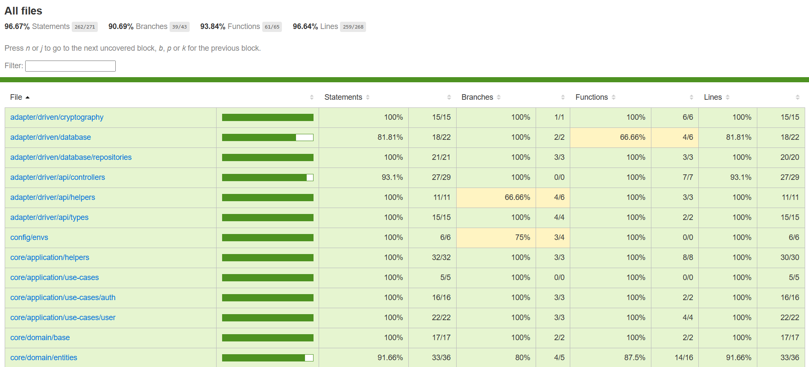

# API User Manager - Grupo 38-7SOAT

Este é o projeto desenvolvido durante o curso de pós-graduação em Arquitetura de Software da FIAP.

Membros do grupo:
* Ketlin Fabri dos Santos – RM35453
* Lucas Antonio dos Santos – RM354629
* Matheus Akio Santos Ishiguro – RM354952

## Propósito do projeto

Implementar uma aplicação de gerenciamento e autenticação de usuários para um sistema de processamento de vídeos

## Stack utilizada

* Node.js v20
* TypeScript
* Postgresql
* Docker
* Kubernetes
* AWS
* Sonarqube
* k8s


## Desenvolvimento do projeto


## Instalação do projeto

Este projeto está preparado para execução em um ambiente Docker. Portanto, será necessária apenas a instalação do Docker e/ou Kubernetes, sem a necessidade de instalar o projeto ou o banco de dados PostgreSQL manualmente.

Caso não tenha o Docker instalado, siga as instruções para seu sistema operacional na [documentação oficial do Docker](https://docs.docker.com/get-docker/).

# Como executar o projeto localmente

- Fazer build da imagem Docker localmente com o comando abaixo:

```bash
❯ docker build -t api-user-manager:latest .
```

# Deploy

Para realizar o deploy desta aplicação, foi utilizado a integração do GitHub Actions, permitindo fazer o deploy diretamente na AWS, utilizando os arquivos Kubernetes presentes na pasta K8S. Para subir a imagem em ambiente produtivo, estamos utilizando o AWS ECR.

### Diagramas de fluxo

Foram utilizadas técnicas de Domain Driven Design para definição dos fluxos:
Todos os diagramas apresentados estão disponíveis no

[Miro](https://miro.com/app/board/uXjVKUHWBkY=/?share_link_id=42148422473).

### Swagger
Todos os endpoints estão disponíveis para consulta via [Swagger](http://localhost:3000/api-docs/).

### Testes
A cobertura dos testes ficaram acima de 80%, conforme mostram as imagens de cobertura do Sonarqube e Jest.

## Cobertura de Testes - SONARQUBE


## Cobertura de Testes - Locais, utilizando Jest

